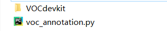
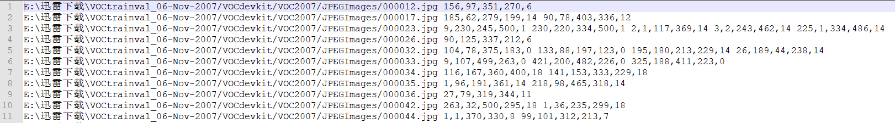

YOLOv3

<!--这段代码用于转化为PDF时候，数学公式能正常渲染。-->

原论文：[YOLOv3: An Incremental Improvement](https://pjreddie.com/media/files/papers/YOLOv3.pdf)

### 网络结构
YOLOv3是在YOLO的前面两个版本的基础上更新起来的，在网络结构上，前面主要是使用了darknet-53的结构做特征提取，仅仅使用了darknet-53的前面52层，去除全连接层。YOLOv3这个网络是一个全卷积网络，大量使用残差的跳层连接，并且为了降低池化带来的梯度负面效果，作者直接摒弃了POOLing，用conv的stride来实现降采样。在这个网络结构中，使用的是步长为2的卷积来进行降采样。

为了加强算法对小目标检测的精确度，YOLO v3中采用类似FPN的upsample和融合做法（最后融合了3个scale，其他两个scale的大小分别是26×26和52×52），在多个scale的feature map上做检测。

作者在3条预测支路采用的也是全卷积的结构，其中最后一个卷积层的卷积核个数是255，是针对COCO数据集的80类：3*(80+4+1)=255，3表示一个grid cell包含3个bounding box，4表示框的4个坐标信息，1表示objectness score。所谓的多尺度就是来自这3条预测之路，y1,y2和y3的深度都是255，边长的规律是13:26:52。yolo v3设定的是每个网格单元预测3个box，所以每个box需要有(x, y, w, h, confidence)五个基本参数，然后还要有80个类别的概率。所以3×(5 + 80) = 255。这个255就是这么来的。

由于最后的特征图都是13的倍数尺寸的，所以YOLOv3要求输入图片的大小长宽都要为13的倍数。

从输入到输出，简单来看，就是YOLO将图片分别分割成为了13x13,26×26和52×52的小块，然后分别在每个小块里面做：
 - 这个小块是不是某个物体的中心，是/否二分类任务
 - 如果有一个物体，这个小块的最中心相对两边的距离，是两个点的回归任务
 - 如果有一个物体，物体在这个图片中的相对大小，也是两个数值的回归任务
 - 如果有一个物体，那么这个物体的可信度

以上就是最简单的YOLO的理解，当然由于需要在一个块中检测多个物体，还使用到了Anchor Box的概念。

### 训练

下载需要的文件：
 - 在[qqwweee/keras-yolo3](https://github.com/qqwweee/keras-yolo3)下载整个项目
 - 在[YOLO](https://pjreddie.com/darknet/yolo/)下载一个weight文件
 - 下载一个数据集[Train/Validation Data (439 MB)](https://pjreddie.com/projects/pascal-voc-dataset-mirror/)

然后把数据集压缩包解压，并把qqwweee/keras-yolo3里面的`voc_annatation.py`复制过去，由于之前下载的是VOC2007的Train/Validation数据集，所以`voc_annatation.py`文件做了小修改，把第四行的
~~~py
sets=[('2007', 'train'), ('2007', 'val'), ('2007', 'test')]
~~~
改成：
~~~py
sets=[('2007', 'train'), ('2007', 'val')]
~~~

直接运行`voc_annatation.py`文件：
~~~
python voc_annatation.py
~~~
这样可以看到生成了两个txt文件，2007_train.txt和2007_val.txt，随便打开一个文件，简单看下是什么数据：

可以明显看到，最前面就是图片的路径，然后有一些数字，在`train.py`的data_generator函数中可以知道，这些数字是5个一组，前四个人分别是标记的四个顶点，最后一个数字是目标的分类标签。一组数字用逗号分隔开，不要有空格，每个检测对象之间用空格分隔开。比如第一张图片就是只有1个检测对象，第二章图片有2个待检测对象。
新建一个空的txt文件，并把代码生成的两个txt的文本复制进去，取名为training_list.txt，这个等下要赋值给`annotation_path`.
现在打开git项目，找到yolov3.cfg文件，这里classes=80,由于我们现在的数据集只能识别20个分类，所以将`yolov3.cfg`中classes都改成20，由于个人的电脑现存不是很大，所以把random改成0，然后filter=3*(classes+5)。
~~~cfg
[convolutional]
size=1
stride=1
pad=1
filters=75## 255
activation=linear

[yolo]
mask = 0,1,2
anchors = 10,13,  16,30,  33,23,  30,61,  62,45,  59,119,  116,90,  156,198,  373,326
classes=20 ## 80
num=9
jitter=.3
ignore_thresh = .5
truth_thresh = 1
random=0 ##1
~~~
这里一共需要改三次，打开.cfg文件，搜索yolo能找到3个，将yolo下面的classes,random改掉，还有yolo上面的一个filters改了。其他的filters数字不要动。
为了不重头开始训练，在训练之前可以加载我们之前下的weight文件，但是不能直接加载，需要使用`convert.py`转化一下：
~~~
python convert.py yolov3.cfg yolov3.weights model_data/yolo.h5
~~~
 - yolov3.cfg就是配置文件
 - yolov3.weights就是前面下载的weights文件，这里和convert.py在同一个目录下，如果不在同一个目录的话，带上路径
 - model_data/yolo.h5就是生成的可以被加载的文件。

这个文件在train.py中被使用的。
~~~py
model = create_model(input_shape, anchors, num_classes, freeze_body=2, weights_path='model_data/yolo_weights.h5')
~~~
那么现在基本上就可以开始训练了，看下训练的参数配置部分：
~~~py
def _main():
    annotation_path = 'training_list.txt'
    log_dir = 'logs/'
    classes_path = 'model_data/voc_classes.txt'
    anchors_path = 'model_data/yolo_anchors.txt'
    class_names = get_classes(classes_path)
    num_classes = len(class_names)
    anchors = get_anchors(anchors_path)
    ......
~~~
其他部分就不看了，这里的`annotation_path = 'training_list.txt'`就是训练数据的信息，training_list.txt文件如果不在项目跟目录下，那么也带上路径。class_path保存了能识别的20个分类的信息，anchors_path是anchor box的信息。

由于下载的权重和训练数据的网络不是一一对应的（下载权重是在COCO数据集上训练的，80分类问题，我们改成了20分类问题），所以在加载权重时候会有一些warning，可以先不要管，因为可以先使用有的一些权重先训练一个大概，然后进一步训练，这也是为什么在train.py会有两个部分，先50个epoch先固定了网络的前面一部分，然后再用50个epoch对整个网络进行训练。报Warning的是三个层的name是Conv2d_59,67,75这三个层是输出层，也就是我们需要训练的层，没有被冻结，所以不需要考虑没加载权重的层在训练时候怎么办。

另外，如果需要训练自己的数据集的话，非常简单，只需要按照格式生成相应的training_list.txt文件就可以了。可以使用labelImg打标签，然后用convert.py转成需要的txt格式（convert.py需要自己稍微改一下)。然后，写一个`xx_class.txt`给classes_path就好了。

### 识别
在训练完成以后，需要使用模型进行识别，按照官方给的方式是使用`yolo_video.py`文件进行的，通过设置参数来进行，但是实际使用中发现设置了参数好像没有用，还是在`yolo.py`文件中，去修改默认参数：
~~~py
class YOLO(object):
    _defaults = {
        "model_path": 'logs/trained_weights_stage_1.h5',  # 'model_data/yolo.h5'
        "anchors_path": 'model_data/yolo_anchors.txt',
        "classes_path": 'model_data/voc_classes.txt',
        "score": 0.3,
        "iou": 0.45,
        "model_image_size": (416, 416),
        "gpu_num": 1,
    }
~~~
主要就是这里的model_path和classes_path的文件路径更改为自己的，然后通过下式识别单张图片。
~~~bash
python yolo_video.py --image
~~~
如果报模型分类数目不匹配的错误，一般就是class_path不正确，如果是报Failed to get convolution algorithm.或者类似Could not create cudnn handle: CUDNN_STATUS_INTERNAL_ERROR的错误，就把电脑其他软件或者其他python程序关闭，再run `python yolo_video.py`。
使用yolo网站上下载的weights转化的网络识别情况还是比较不错的，使用自己又训练的一些数据后，loss基本上下降到20左右，再识别的话，再数据集内的识别还是可以的，数据集外的识别相对来说就情况不是很好了。

### Issue
1. 遇到报错`module ‘keras.backend’ has no attribute ‘control_flow_ops’`的问题是由于keras的版本问题，换到keras2.1.5版本就可以。
    ~~~bash
    pip uninstall keras
    pip install keras==2.1.5
    ~~~
2. 训练到什么样子算是可以了？
   使用VOC数据集训练，训练到loss下降到20左右时候，基本上，VOC数据集的效果还可以的。
   
3. 生成的视频大小为0KB。
    由于编码方式在本地不支持，需要改一下：
    ~~~py
    # 电脑上这个参数生成的视频为0KB,切换的编码方式
    # video_FourCC = int(vid.get(cv2.CAP_PROP_FOURCC))
    video_FourCC = cv2.VideoWriter_fourcc(*'XVID')
   ~~~

### 参考
1. [YOLOv3: 训练自己的数据(绝对经典版本1)](https://blog.csdn.net/lilai619/article/details/79695109)
2. [自有数据集上,如何用keras最简单训练YOLOv3目标检测](https://blog.csdn.net/sinat_26917383/article/details/85614247)
3. [windows10+keras下的yolov3的快速使用及自己数据集的训练](https://blog.csdn.net/u012746060/article/details/81183006)
4. [YOLOv3 深入理解](https://www.jianshu.com/p/d13ae1055302)
